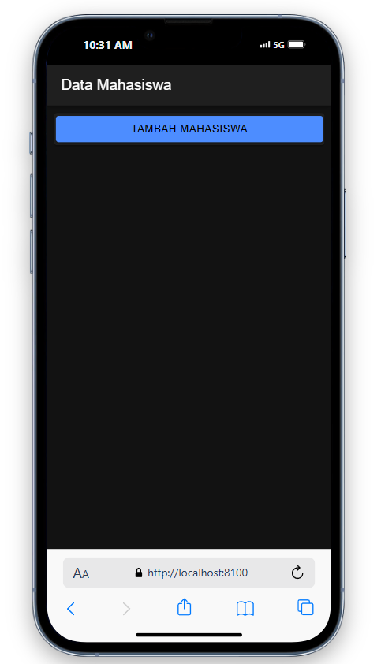
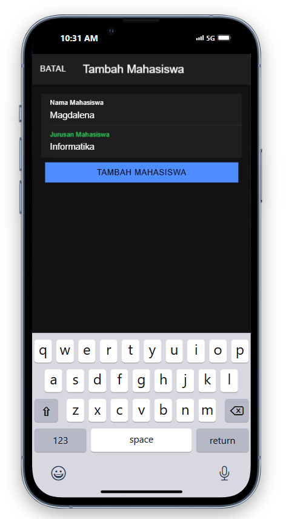
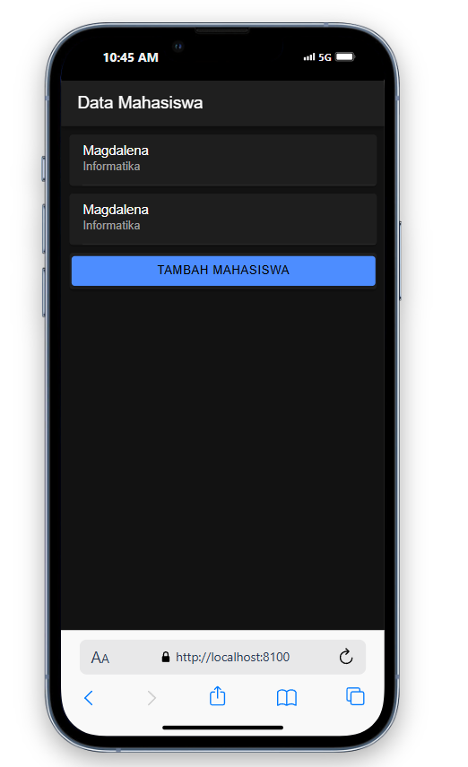
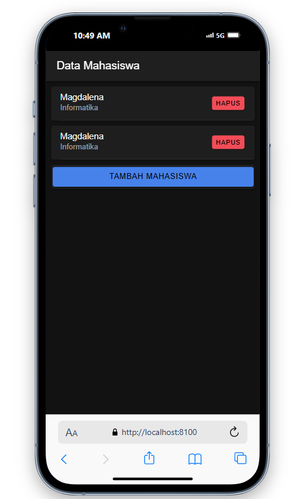
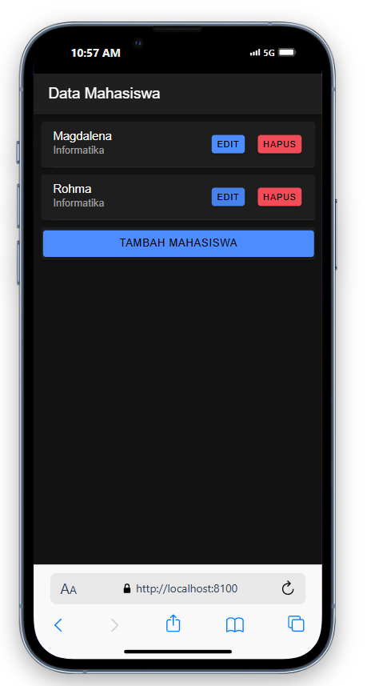
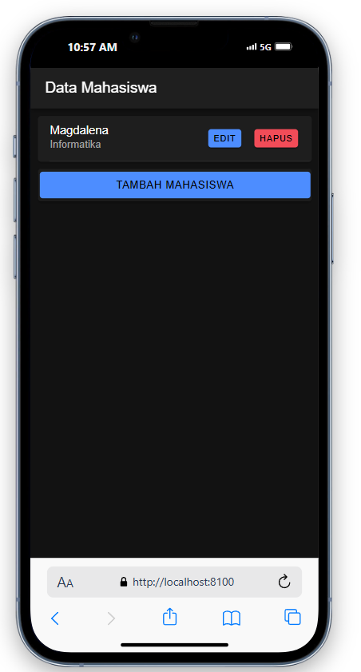
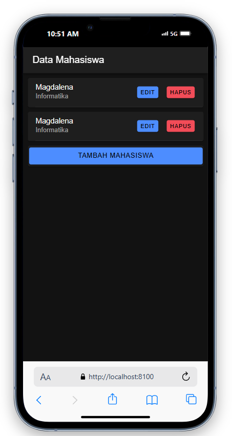
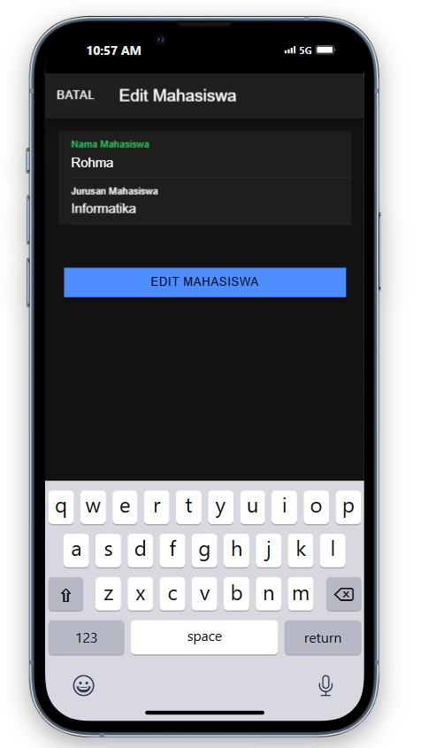

# Penjelasan
1. Membuat Database dan Tabel Mahasiswa
Database: Buat database db_mhs di MySQL.
Tabel Mahasiswa: Buat tabel bernama mahasiswa dengan kolom-kolom yang dibutuhkan, seperti id, nama, dan jurusan.
2. Membuat PHP API
koneksi.php: Menyediakan koneksi database untuk berinteraksi dengan db_mhs.
tampil.php: Menampilkan seluruh data mahasiswa dalam bentuk JSON.
tambah.php: Menambahkan data baru ke tabel mahasiswa.
lihat.php: Mengambil data mahasiswa berdasarkan id tertentu.
hapus.php: Menghapus data mahasiswa berdasarkan id.
edit.php: Mengedit data mahasiswa yang ada di database.
3. Persiapan Project di Ionic
Ionic Project: Buat project baru menggunakan Ionic dengan perintah ionic start crud_mhs.
Page Mahasiswa: Buat halaman mahasiswa untuk tampilan utama CRUD.
Service API: Buat api.service.ts untuk komunikasi dengan PHP API yang sudah dibuat.
4. Menampilkan Data Mahasiswa
   
   
mahasiswa.page.ts: Fungsi getMahasiswa() akan menampilkan seluruh data mahasiswa yang diambil dari API tampil.php.
mahasiswa.page.html: Menampilkan data mahasiswa dalam kartu yang menampilkan nama dan jurusan.
6. Menambahkan Data Mahasiswa
   
   
mahasiswa.page.ts:
Fungsi openModalTambah() membuka modal form untuk menambah data.
Fungsi tambahMahasiswa() mengirim data baru ke API tambah.php.
mahasiswa.page.html: Menampilkan tombol "Tambah Mahasiswa" dan modal input data baru.
8. Menghapus Data Mahasiswa
  
  
mahasiswa.page.ts: Fungsi hapusMahasiswa(id) menghapus data mahasiswa berdasarkan id dengan memanggil API hapus.php.
mahasiswa.page.html: Tombol "Hapus" ditambahkan pada kartu data untuk menghapus data mahasiswa.
10. Mengedit Data Mahasiswa
    
    
mahasiswa.page.ts:
Fungsi openModalEdit() membuka modal form untuk mengedit data mahasiswa yang dipilih.
Fungsi editMahasiswa() mengirim data yang sudah diubah ke API edit.php.
mahasiswa.page.html: Menampilkan tombol "Edit" dan modal form untuk memperbarui data mahasiswa yang ada.
